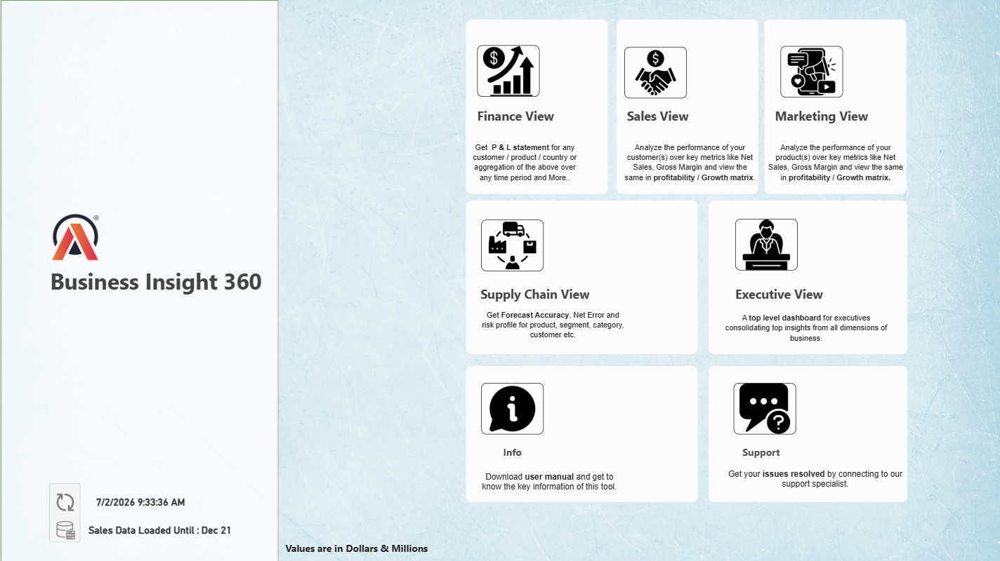
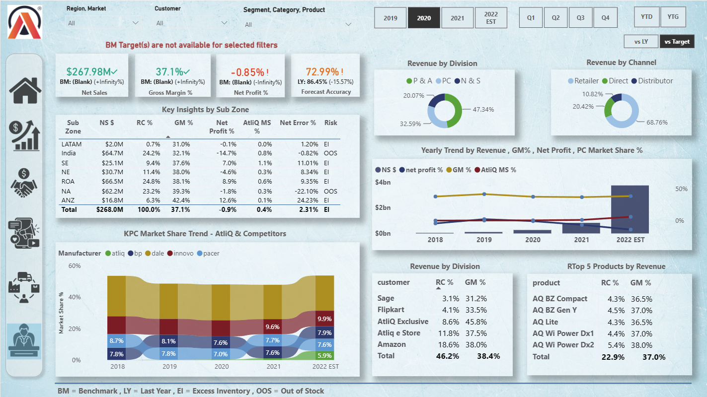
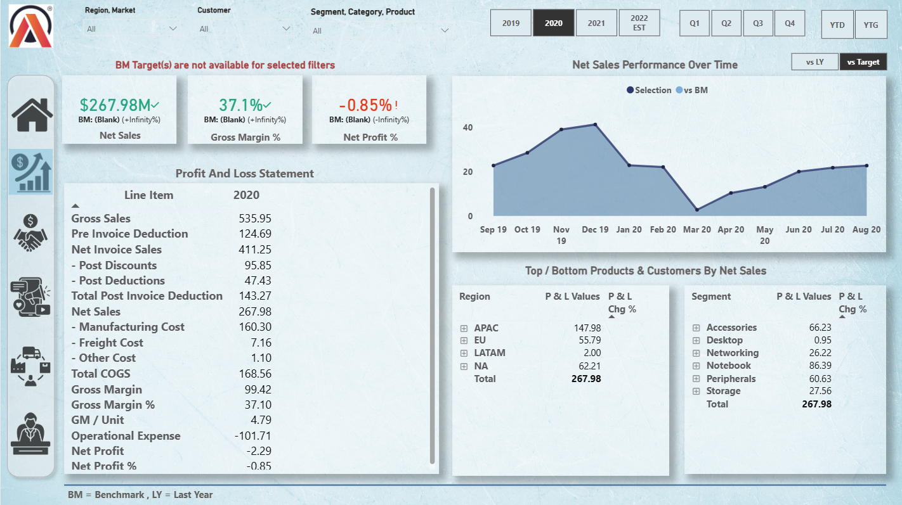
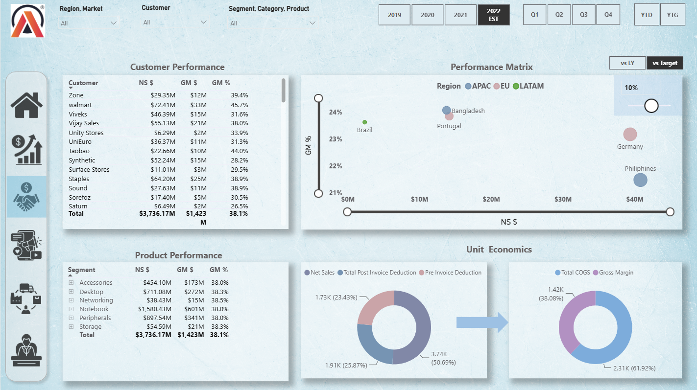
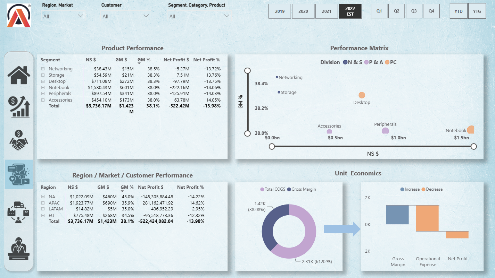
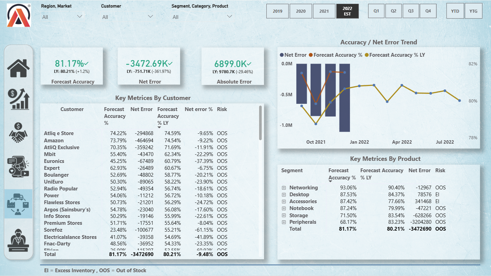
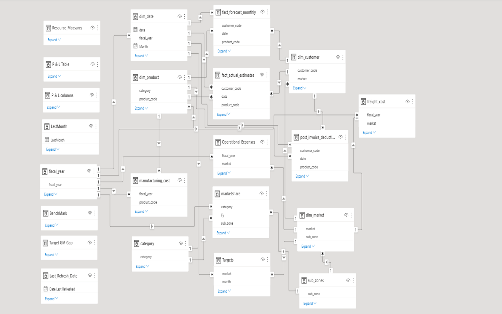

<h1 align="center">📊 Enterprise Business Intelligence Dashboard</h1>

Turning enterprise data into actionable business decisions.

  
  
  
  
  

### Turning enterprise data into actionable business decisions.

An end-to-end Business Intelligence solution developed in **Power BI** to help Executive, Finance, Sales, Marketing, and Supply Chain teams monitor KPIs, identify trends, and make data-driven decisions.

> Developed as part of the **Codebasics BI 360 Challenge**, with a focus on business storytelling, dimensional modeling, DAX, and interactive analytics.

## 📖 Project Overview

This project is an end-to-end Business Intelligence solution built in **Power BI** to provide a unified reporting experience across multiple business functions.

The solution enables different stakeholders—including Executive, Finance, Sales, Marketing, and Supply Chain teams—to monitor key performance indicators, analyze trends, and make informed business decisions through interactive dashboards.

The report follows a business-first approach, combining data modeling, DAX, Power Query, and visualization best practices to transform raw data into actionable insights.

## 🏢 Business Problem

Modern organizations generate massive amounts of data across different business functions. However, each department has unique goals and requires different insights to make effective decisions.

- Executive teams need a high-level view of overall business performance.
- Finance teams monitor profitability, margins, and financial health.
- Sales teams track customer and regional performance.
- Marketing teams evaluate product and customer profitability.
- Supply Chain teams focus on forecast accuracy and operational efficiency.

Without a centralized reporting solution, decision-making becomes fragmented and time-consuming.

This project addresses that challenge by providing a unified Business Intelligence platform that delivers interactive, role-based dashboards to support data-driven decision-making across the organization.

## 🎯 Project Objectives

- Build a centralized Business Intelligence solution for enterprise reporting.
- Deliver role-specific dashboards for Executive, Finance, Sales, Marketing, and Supply Chain teams.
- Enable interactive analysis through filters, drill-through, and dynamic KPIs.
- Apply dimensional data modeling and DAX best practices for scalable reporting.
- Transform business data into actionable insights that support data-driven decision-making.

## ✨ Solution Highlights

✔ Enterprise-level Business Intelligence solution built in Power BI

✔ Role-based dashboards for Executive, Finance, Sales, Marketing, and Supply Chain stakeholders

✔ Interactive navigation with dedicated Home, Support, and Information pages

✔ Drill-through analysis using a dedicated Sales Trend page

✔ KPI-driven reporting with dynamic DAX measures

✔ Dimensional data model designed for scalable analytics

✔ Interactive filtering and cross-report analysis for business decision-making

✔ Published to Power BI Service for cloud-based access

## 🛠️ Tech Stack

- **Power BI Desktop**
- **Power Query**
- **DAX (Data Analysis Expressions)**
- **Data Modeling**
- **Power BI Service**
- **Microsoft Excel**

## 📸 Dashboard Gallery

A centralized Business Intelligence platform designed to serve different stakeholders across the organization.

| 🏠 Home | 👔 Executive |
|---------|-------------|
|  |  |

| 💰 Finance | 📈 Sales |
|------------|----------|
|  |  |

| 📣 Marketing | 🚚 Supply Chain |
|--------------|----------------|
|  |  |

 ## 🗂️ Data Model & Architecture

The report is built on a dimensional data model designed to support fast, scalable, and accurate business reporting.

The model consists of fact tables that capture transactional data and dimension tables that provide descriptive business context, including customers, products, markets, and dates. This structure enables efficient filtering, simplified DAX calculations, and consistent KPI reporting across all dashboards.

By following data modeling best practices, the solution ensures high performance, reusability of measures, and a scalable foundation for enterprise-level analytics.

### Data Model

## 💡 Business Insights

### 👔 Executive View
Provides a high-level overview of business performance by consolidating key KPIs, revenue trends, profitability, and operational metrics into a single decision-making dashboard.

### 💰 Finance View
Enables financial analysis through Net Sales, Gross Margin, Gross Margin %, and profitability metrics, allowing decision-makers to compare actual performance against targets and identify areas requiring attention.

### 📈 Sales View
Helps evaluate customer, product, and regional sales performance while uncovering growth opportunities through detailed sales analysis and trend comparisons.

### 📣 Marketing View
Supports marketing teams in analyzing customer and product profitability, helping identify high-value segments and optimize marketing strategies.

### 🚚 Supply Chain View
Monitors forecast accuracy, operational efficiency, and supply chain performance to improve planning and inventory-related decisions.

### 📉 Sales Trend
Provides drill-through capabilities for deeper analysis of historical sales performance, enabling users to investigate trends and patterns beyond high-level KPIs.

## ⚙️ Technical Highlights

- Designed an enterprise-ready dimensional data model using fact and dimension tables for efficient reporting.

- Developed reusable DAX measures to calculate key business KPIs including Net Sales, Gross Margin, Gross Margin %, Forecast Accuracy, and Year-over-Year comparisons.

- Implemented interactive report navigation with a dedicated Home page, Support page, and Information page to improve user experience.

- Built stakeholder-specific dashboards tailored to Executive, Finance, Sales, Marketing, and Supply Chain teams.

- Applied Power Query for data transformation, cleaning, and preparation before loading the model.

- Designed an intuitive reporting experience using slicers, drill-through pages, bookmarks, and cross-filtering interactions.

- Published the solution to Power BI Service for cloud-based reporting and accessibility.

## 🧠 Engineering Highlights

### Data Modeling
✔ Designed a star schema with X fact tables and Y dimension tables.

### DAX Engineering
✔ Developed XX+ reusable DAX measures.

✔ Implemented dynamic KPI calculations using SWITCH().

✔ Built time intelligence measures for YoY analysis.

### User Experience

✔ Bookmark navigation

✔ Drill-through

✔ Dynamic filtering

✔ Tooltip pages

✔ Responsive layouts

### Deployment

✔ Published to Power BI Service

✔ Optimized for stakeholder reporting

## 📊 Key Metrics Tracked

The report enables stakeholders to monitor a comprehensive set of business KPIs across different functional areas, including:

### Revenue & Profitability
- Net Sales
- Gross Margin
- Gross Margin %
- Net Profit
- Net Profit %

### Sales Performance
- Customer Performance
- Product Performance
- Regional Performance
- Year-over-Year (YoY) Growth
- Actual vs Target Analysis

### Supply Chain
- Forecast Accuracy
- Net Error
- Absolute Error
- Operational Performance Metrics

### Executive KPIs
- Revenue Trends
- Profitability Trends
- Market Performance
- Business Growth Indicators

## 📚 Key Learnings

Building this project changed my perspective on Business Intelligence.

Initially, I believed that creating dashboards was primarily about designing visuals and writing DAX measures. Throughout this project, I realized that effective Business Intelligence starts much earlier—with understanding business processes, stakeholder requirements, and the questions each department needs answered.

One of the biggest takeaways was learning how the same dataset can deliver completely different value depending on the stakeholder. Finance focuses on profitability, Sales on growth, Marketing on customer value, Supply Chain on operational efficiency, and Executives on strategic performance. A well-designed BI solution brings all of these perspectives together through a single, trusted data model.

From a technical perspective, I strengthened my understanding of dimensional modeling, Power Query, DAX, report navigation, and performance-focused dashboard design. More importantly, I learned that technical skills create value only when they solve real business problems.

> **The most valuable lesson from this project was that Business Intelligence is not about building dashboards—it is about enabling better business decisions through data.**

## 🚀 Future Improvements

Although this project demonstrates an end-to-end Business Intelligence solution, there are several enhancements that could further improve its capabilities:

- Integrate incremental refresh for large-scale datasets.
- Implement Row-Level Security (RLS) for role-based data access.
- Connect to live cloud data sources such as Azure SQL Database or Microsoft Fabric.
- Introduce AI-powered visuals and forecasting for predictive insights.
- Optimize DAX measures for enterprise-scale performance.
- Expand executive reporting with additional strategic KPIs.

## 🙏 Acknowledgements

This project was developed as part of the **Codebasics BI 360 Challenge**, a real-world Business Intelligence case study designed to simulate enterprise reporting scenarios.

I would like to express my sincere gratitude to **Dhaval Patel** and the entire **Codebasics** team for creating a project that emphasizes not only Power BI development, but also business thinking, stakeholder analysis, and data-driven decision-making.

This project has been an important milestone in my journey toward becoming a Business Intelligence and Data Analytics professional.

---

## 👨‍💻 About the Developer

Hi! I'm **Shirsh**, an aspiring Data Analyst passionate about transforming raw data into meaningful business insights.

This project represents much more than learning Power BI—it reflects my journey toward understanding how Business Intelligence empowers organizations to make informed, data-driven decisions.

I'm continuously strengthening my skills in:

- 📊 Power BI
- 🧮 DAX
- 🗄 SQL
- 🐍 Python
- 📈 Data Analytics
- 📖 Business Intelligence

I believe great dashboards don't just visualize data—they communicate stories, uncover opportunities, and support better business decisions.

---

⭐ **If you found this project interesting, consider giving this repository a star!**
